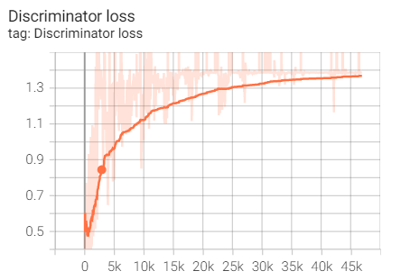

# Generative Adversarial Nets

Pytorch Implementation of [Generative Adversarial Nets(GAN)](https://arxiv.org/abs/1406.2661)

Both generator and discriminator are multi-layer perceptrons with leaky-relu activations.

### Installation

```bash
git clone git@github.com:wonjun-dev/GAN-Pytorch.git
python3 -m venv .venv
. .venv/bin/activate
pip install -r requirments.txt
```

### Train

```bash
python main.py --n_epochs=100 --batch_size=128 --dataset=mnist --latent_dim=100 --expr_name=mlp --lr=2e-4
```

- n_epochs: [int] number of epochs
- batch_size: [int] minibatch size
- dataset: [str] dataset name <mnist, cifar10>
- latent_dim: [int] dimension of noise $z$
- expr_name: [str] tensorboard run name
- lr: [float] learning rate

### Result

- Learning curves on MNIST

<p float='left'>
    
    
</p>

- Generated MNIST images
<p float='left'>
    
    
    
</p>