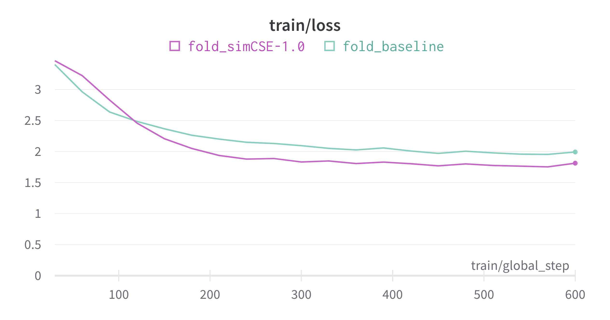
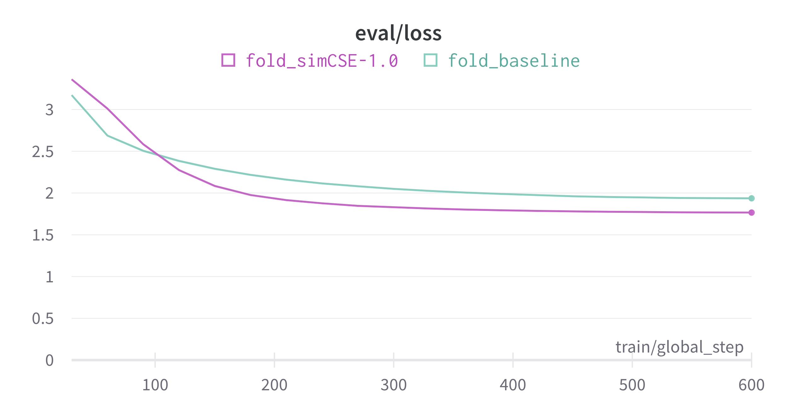
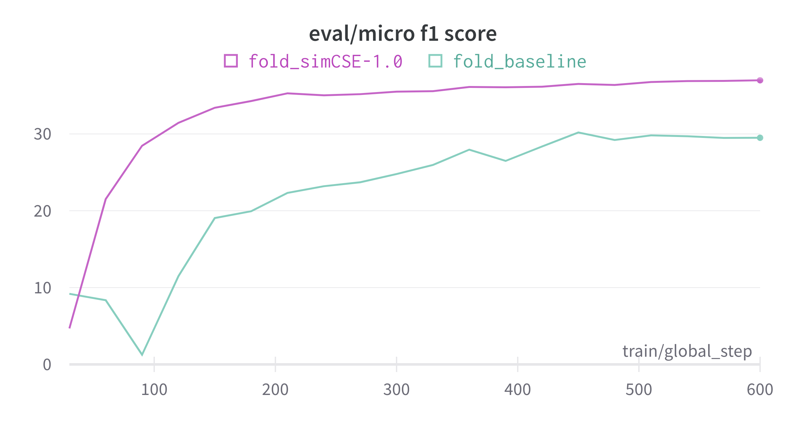
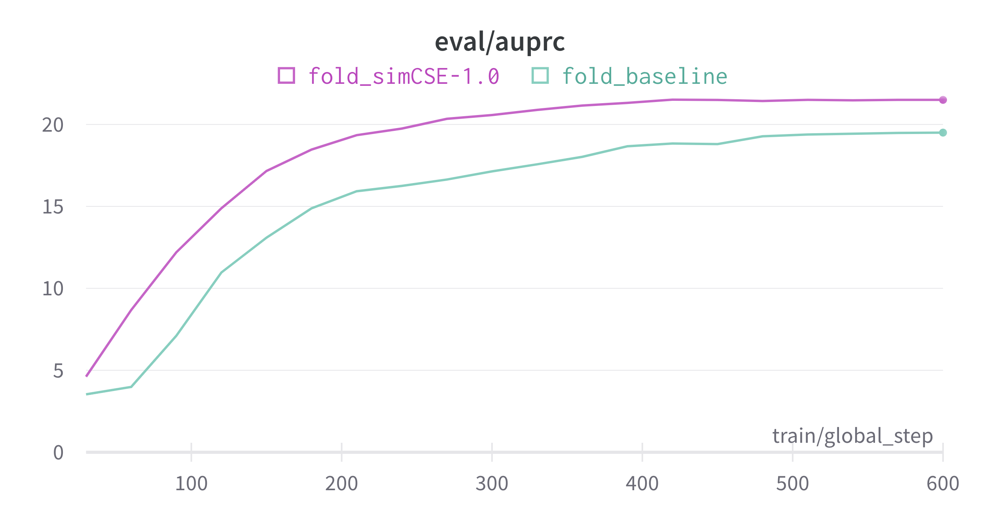

# SimCSE: Simple Contrastive Learning of Sentence Embeddings

This is a [SimCSE](https://arxiv.org/abs/2104.08821) implementation that performed sentence embedding using contrastive learning. This is an experiment that confirmed the effectiveness in the Relation Extraction task of the KLUE benchmark.

As a result of the experiment, the alignment and uniformity of the [CLS] token were improved, and faster convergence, f1 score, and auprc were improved in linear evaluation. 

## Results

